# CPU instruction execution: image brightness processing

**BSC104 final project · Combined report, version 1 (with step traces and measured optimizations) · 29 September 2026**

## Summary

This report covers twelve recorded experiments on the four required test cases. Runs 1–8 come from two group repositories (two final-state runs per case). Runs 9–12 are complete step-by-step traces recorded for this version, one per case. Every run processed 16 pixels. Cache misses were the largest source of waiting in eleven of the twelve runs; in the traced Worst Case run a rare single miss left the seven branch mispredictions as the larger delay.

The three recorded totals per case are 351, 413 and 366 for Best; 502, 504 and 378 for Worst; 406, 436 and 451 for Real Case 1; and 444, 459 and 397 for Real Case 2. The spread inside a case comes from the simulator's random cache and branch outcomes. Runs 9–12 also record the cache result and branch outcome of every one of the 16 iterations, so the event positions that the earlier final-state runs could not capture are now evidenced.

All 192 recorded input/output pairs are consistent with the brightness rule: 141 inputs were read directly (93 from screenshot transcriptions, 48 from live step records), 48 are the all-zero Best Case definition, and three Real Case 2 values were inferred from their outputs. Section 3 reports measurements, not just estimates: branch-free selection, four-pixel loop unrolling, pointer loop-testing and their combination were implemented as modified copies of the simulator, and each program was run 40 times per test case (800 measured runs, every output checked). The combined program gives the best measured mean for Worst Case (−34.5%), Real Case 1 (−23.2%) and Real Case 2 (−19.2%); unrolling gives the best Best-Case mean (−12.8%). Cache prefetching remains a calculation because the simulator models no cache contents.

The requirement table in Section 5 and [Grading.md](Grading.md) assess this evidence.

## Sources and method

The main requirements are the four deliverables in the supplied [project scenario](Sources/Local/Project%201%20Scenario_%20CPU%20Instruction%20Execution%20-%20Image%20Brightness%20Processing.md). The [quick guide](Sources/Local/How%20to%20Use%20Project%201%20CPU%20Simulator%20-%20Quick%20Guide.md) supplies six supporting questions. The more detailed scenario governs where the guide gives a simpler workflow.

| Source set | Repository snapshot | Contribution |
|---|---|---|
| Local | WillowMT/202610-final-prj, `16affd82bf9f668d5671e055aa3e76297dfe63dd` | Runs 1–4, eight screenshots, logs, reports, workbook and verification script |
| Scarlet | Scarlet-astra/BSC104_final_project, `016e2f92b9186c4a5ae9b7b9b27ed8eee4e915f9` | Runs 5–8, twelve screenshots, repeat-run analysis, workbook and blank trace template |
| New evidence (this version) | [Traces/](Traces/) and [Optimizations/](Optimizations/) in this folder | Runs 9–12 step records with 24 checkpoint screenshots, four variant simulators and 800 measured runs; checksums in [evidence_manifest.json](evidence_manifest.json) |

The [repository comparison](Repository_Comparison.md) explains what was retained and corrected. Unmodified source files are included in `Sources/`; [source_manifest.json](source_manifest.json) records their origin and SHA-256 checksums. Both copies of the simulator, scenario and quick guide are identical. The archived reports are source documents; this combined report contains the reconciled conclusions.

Recorded metrics for Runs 1–8 come from the [Local logs](Sources/Local/Logs.md) and [Scarlet logs](Sources/Scarlet/Logs.md), checked against screenshots. Runs 9–12 and the optimization measurements were recorded from the same unchanged simulator for this version; their drivers, raw records and analysis scripts are in `Traces/` and `Optimizations/`. Instruction behavior comes from the [simulator source](Sources/Local/Project1_CPU_Simulator.html). Averages, reconstructed paths and workload projections are calculations; the optimization results in Section 3 are measurements.

**Screenshot evidence is embedded below:** Figures 1–4 show pixel memory, Figures 5–16 show execution checkpoints, and Figures 17–20 show final metrics for all four cases. The [screenshot gallery](#appendix-a-screenshot-gallery) includes all 44 run screenshots and five optimization sample screenshots. Each figure identifies its run and links to its original image. Pixel and metric figures are unscaled crops; checkpoint figures rearrange the four status boxes above the register panel from the **same screenshot**. Values, colors and existing visibility limitations are preserved. These are presentation copies of the existing evidence, not additional experiments; crop coordinates and source checksums are in [Figures/manifest.json](Figures/manifest.json).

## 1. Instruction trace and experiment evidence

### 1.1 The twelve experiments

Each screenshot group records one completed run. The 20 final-state screenshots and 24 checkpoint screenshots therefore support twelve experiments, not 44. All runs finished 16/16 pixels, with final PC `0x34`.

<!-- table:runs -->
| Run | Run ID | Case and input pattern | Animation delay | Source evidence |
|---|---|---|---|---|
| 1 | BC-50-R1 | Best: sixteen zeros | 50 ms | [Summary/registers](Sources/Local/Screenshots/BC-1.png), [pixels/metrics](Sources/Local/Screenshots/BC-2.png) |
| 2 | WC-50-R1 | Worst: alternating 64 and 192 | 50 ms | [Summary/registers](Sources/Local/Screenshots/WC-1.png), [pixels/metrics](Sources/Local/Screenshots/WC-2.png) |
| 3 | RC1-50-R1 | Real 1: 11 dark and 5 bright pixels | 50 ms | [Summary/registers](Sources/Local/Screenshots/RC1-1.png), [pixels/metrics](Sources/Local/Screenshots/RC1-2.png) |
| 4 | RC2-50-R1 | Real 2: 8 bright followed by 8 dark | 50 ms | [Summary/registers](Sources/Local/Screenshots/RC2-1.png), [pixels/metrics](Sources/Local/Screenshots/RC2-2.png) |
| 5 | BC-500-R2 | Best: sixteen zeros | 500 ms | [Summary](Sources/Scarlet/Screenshots/BC-R2-1.png), [registers/pixels](Sources/Scarlet/Screenshots/BC-R2-2.png), [metrics](Sources/Scarlet/Screenshots/BC-R2-3.png) |
| 6 | WC-500-R2 | Worst: alternating 64 and 192 | 500 ms | [Summary](Sources/Scarlet/Screenshots/WC-R2-1.png), [registers](Sources/Scarlet/Screenshots/WC-R2-2.png), [pixels/metrics](Sources/Scarlet/Screenshots/WC-R2-3.png) |
| 7 | RC1-500-R2 | Real 1: same input list as Run 3 | 500 ms | [Summary](Sources/Scarlet/Screenshots/RC1-R2-1.png), [registers](Sources/Scarlet/Screenshots/RC1-R2-2.png), [pixels/metrics](Sources/Scarlet/Screenshots/RC1-R2-3.png) |
| 8 | RC2-500-R2 | Real 2: new values, same 8/8 split | 500 ms | [Summary](Sources/Scarlet/Screenshots/RC2-R2-1.png), [registers](Sources/Scarlet/Screenshots/RC2-R2-2.png), [pixels/metrics](Sources/Scarlet/Screenshots/RC2-R2-3.png) |
| 9 | BC-50-R3 | Best: sixteen zeros, full step trace | 50 ms | [step log](Traces/Run9_BC_StepLog.md) · [start](Traces/Run9_BC_01_setup.png) · [pixel 1](Traces/Run9_BC_04_pixel1_done.png) · [final](Traces/Run9_BC_06_final.png) |
| 10 | WC-50-R3 | Worst: alternating, full step trace | 50 ms | [step log](Traces/Run10_WC_StepLog.md) · [start](Traces/Run10_WC_01_setup.png) · [pixel 1](Traces/Run10_WC_04_pixel1_done.png) · [final](Traces/Run10_WC_06_final.png) |
| 11 | RC1-50-R3 | Real 1: same fixed list, full step trace | 50 ms | [step log](Traces/Run11_RC1_StepLog.md) · [start](Traces/Run11_RC1_01_setup.png) · [pixel 1](Traces/Run11_RC1_04_pixel1_done.png) · [final](Traces/Run11_RC1_06_final.png) |
| 12 | RC2-50-R3 | Real 2: new values, full step trace | 50 ms | [step log](Traces/Run12_RC2_StepLog.md) · [start](Traces/Run12_RC2_01_setup.png) · [pixel 1](Traces/Run12_RC2_04_pixel1_done.png) · [final](Traces/Run12_RC2_06_final.png) |

The animation setting is a delay between displayed instructions, not the CPU clock. The code uses it in `setTimeout`, separately from cycle accounting, so it cannot change any cycle count; larger values only make the animation slower. The different totals within a case come from random cache and branch outcomes.

Real Case 1's fixed list is 68.75% dark, close to the 70% label. Real Case 2 is generated when the page loads. Runs 4, 8 and 12 repeat a distribution, not exactly the same input image; all three still have identical instruction costs because each has eight bright pixels.

### 1.2 Algorithm, registers and execution

For each input pixel `p`, the required output is `p + 32` if `p < 128`, otherwise `p - 8`. The program loads a pixel, compares it with the threshold, chooses an arithmetic path, stores the result, then updates the address and loop counter.

Conceptually, fetch selects the instruction at the PC, decode identifies its operation and register operands, and execute performs it and chooses the next PC. The teaching simulator advances one whole instruction at a time. It does not record individual hardware pipeline stages or overlapping instructions.

| Register | Role |
|---|---|
| R0 | Processed-pixel counter |
| R1 | Pixel pointer, starting at 1024 |
| R2 | Threshold, 128 |
| R3 | Current input pixel |
| R4 | Adjusted output pixel |
| R5 | Initialized to zero; unused in the baseline loop |
| R6 | Dark-pixel addition, 32 |
| R7 | Positive subtraction operand, 8 |

The interface defines eight registers. The scenario describes a processor with 32 general-purpose registers, but the simulator is not a full model of that processor. There are seven registers used by the baseline instructions and no stack spill/reload instructions.

### 1.3 Instruction costs and PC paths

| PC | Instruction | Base cycles | Effect and next instruction |
|---|---|---|---|
| 0x00 | `LOAD R0, #0` | 1 | Set counter to 0; next 0x04 |
| 0x04 | `LOAD R1, #1024` | 1 | Set starting address; next 0x08 |
| 0x08 | `LOAD R3, [R1]` | 3 | Read pixel; add 47 if a cache miss; next 0x0C |
| 0x0C | `CMP R3, R2` | 1 | Compare brightness; next 0x10 |
| 0x10 | `BLT DARK` | 1 | Dark → 0x1C, bright → 0x14; add 15 if prediction is incorrect |
| 0x14 | `SUB R4, R3, R7` | 1 | Bright output = input − 8; next 0x18 |
| 0x18 | `JMP STORE` | 2 | Jump to 0x20 |
| 0x1C | `ADD R4, R3, R6` | 1 | Dark output = input + 32; next 0x20 |
| 0x20 | `STORE R4, [R1]` | 3 | Write output; next 0x24 |
| 0x24 | `INC R1, #1` | 1 | Advance address; next 0x28 |
| 0x28 | `INC R0, #1` | 1 | Advance pixel count; next 0x2C |
| 0x2C | `CMP R0, #16` | 1 | Check completion; next 0x30 |
| 0x30 | `BNE LOOP` | 1 | Return to 0x08, or move to 0x34 after pixel 16 |
| 0x34 | `HALT` | 0 counted | Displayed stop position; the simulator stops before executing it |

The instruction list labels `HALT` as 1 cycle, but the simulator returns before adding that cycle. Stores always cost 3 cycles; only pixel loads contribute to the cache hit/miss counters. A cache-miss load costs **50 cycles total**, which is its 3-cycle base plus 47 extra cycles.

```text
Dark:   08 → 0C → 10 → 1C → 20 → 24 → 28 → 2C → 30     = 13 base cycles
Bright: 08 → 0C → 10 → 14 → 18 → 20 → 24 → 28 → 2C → 30 = 15 base cycles

Base cycles for 16 pixels = 2 + 13 × dark_count + 15 × bright_count
                         = 210 + 2 × bright_count
Executed instructions    = 2 + 9 × dark_count + 10 × bright_count
```

<!-- table:instruction-counts -->
| Instruction executions per run | Best (Runs 1, 5, 9) | Worst (Runs 2, 6, 10) | Real 1 (Runs 3, 7, 11) | Real 2 (Runs 4, 8, 12) |
|---|---|---|---|---|
| Each setup instruction: 0x00, 0x04 | 1 | 1 | 1 | 1 |
| Each of 0x08, 0x0C, 0x10 | 16 | 16 | 16 | 16 |
| Each of 0x14, 0x18 | 0 | 8 | 5 | 8 |
| 0x1C | 16 | 8 | 11 | 8 |
| Each of 0x20, 0x24, 0x28, 0x2C, 0x30 | 16 | 16 | 16 | 16 |
| Total executed instructions | 146 | 154 | 151 | 154 |
| Base cycles before delays | 210 | 226 | 220 | 226 |

### 1.4 Pixel paths, final state and event history

The [pixel-path appendix](Appendix_Pixel_Paths.md) contains all 128 inputs of Runs 1–8, their evidence basis, outputs, paths and cumulative base-cycle totals. Runs 9–12 have their own recorded logs (Section 1.5). For pixel `n`, the load address is `1023 + n`. After that iteration, R0 = `n`, R1 = `1024 + n`, R3 contains its input and R4 contains its output.

Every run finishes with R0 = 16 (`0x10`) and R1 = 1040 (`0x410`). The execution summary shows the last executed instruction, `0x30 BNE LOOP`, while Current PC shows the next position, `0x34`. The final R3/R4 pairs are 0/32 for Best, 192/184 for Worst, 140/132 for Real 1, 60/92 for Run 4, and 55/87 for Run 8. R7 is clipped in Local's screenshots; Scarlet's register screenshots and all four trace runs show `0x08` directly.

The input evidence has three levels:

- 93 inputs come from screenshot transcriptions (Runs 1–8, read directly from readable cells), and 48 more were read from the live step records of Runs 9–12.
- 48 Best Case inputs (Runs 1, 5, 9) come from the all-zero test definition; the cell text is black on black.
- Three Real Case 2 values were inferred from their outputs: Run 4 pixels 9 and 12 (6 from output 38) and Run 8 pixel 15 (8 from output 40). Run 12's Real Case 2 inputs were all recorded directly, so it adds no inference.

All pairs are mathematically consistent with the brightness rule. The three inferred pairs cannot independently establish output correctness because the same rule was used to obtain their inputs.

#### Visible pixel memory: one completed run per case

The top grid in each figure shows the input pixels; the bottom grid shows the stored outputs. Read each grid left to right, then top to bottom. Dark cells retain the simulator's low-contrast text; the numeric input/output lists are also available in the linked step logs.


**Figure 1 — Best Case, Run 9.** All sixteen zero inputs produce 32. The input numbers are black on black, so their values come from the case definition rather than a visual reading. [Original screenshot](Traces/Run9_BC_06_final.png) · [Recorded pixel values](Traces/Run9_BC_StepLog.md).


**Figure 2 — Worst Case, Run 10.** Alternating inputs 64 and 192 become 96 and 184, respectively. [Original screenshot](Traces/Run10_WC_06_final.png) · [Recorded pixel values](Traces/Run10_WC_StepLog.md).


**Figure 3 — Real Case 1, Run 11.** The mixed input takes both arithmetic paths; for example, the first two pixels change from 35 to 67 and from 180 to 172. [Original screenshot](Traces/Run11_RC1_06_final.png) · [Recorded pixel values](Traces/Run11_RC1_StepLog.md).


**Figure 4 — Real Case 2, Run 12.** The first eight bright pixels take subtraction and the last eight dark pixels take addition. The first pixel changes from 232 to 224; pixel 9 changes from 1 to 33. [Original screenshot](Traces/Run12_RC2_06_final.png) · [Recorded pixel values](Traces/Run12_RC2_StepLog.md).

For an actual timing history, define `M_i = 1` for a cache miss on pixel i and `B_i = 1` for an incorrect brightness prediction. Then:

```text
Cycles for pixel i = base_path_cycles_i + 47 × M_i + 15 × B_i
Running actual cycles after pixel n = 2 + sum(cycles for pixels 1 through n)
```

Runs 1–8 provide the sums of `M_i` and `B_i` but not their positions. Runs 9–12 record every position. Run 1 has no incorrect predictions, so all its `B_i` values are zero; even there, its three cache-miss positions remain unknown. Assigning delays to specific pixels in Runs 1–8 would fabricate an event history; Runs 9–12 were recorded specifically to avoid that.

The archived [Worst Case trace workbook](Sources/Scarlet/Step_Trace_Worst_Case.xlsx) contains a prepared template. Its observation cells F12:G27 and J11:J27 are empty. Formula-generated expected totals in that file are not recorded results, and Runs 9–12 supersede it as trace evidence.

### 1.5 Recorded step traces (Runs 9–12)

Each traced run was recorded by advancing the simulator one instruction at a time through its own STEP behavior and logging the state after every step: executed PC, cycle interval, running total, registers, pixel counter, and the cache/branch message. Each step log lists six checkpoint screenshots (setup, first load, first branch decision, pixel 1 done, pixel 8 done, final). Setup, pixel-1 and final-state panels are embedded below; all six screenshots appear in the appendix gallery. The step logs are genuine records, not reconstructions:

<!-- table:trace-runs -->
| Run | Run ID | Total cycles | Base cycles | Steps recorded | Cache misses (positions of 16) | Brightness mispredictions (positions) |
|---|---|---|---|---|---|---|
| 9 | BC-50-R3 | 366 | 210 | 146 | 3 (pixels 7, 13, 14) | 1 (pixels 11) |
| 10 | WC-50-R3 | 378 | 226 | 154 | 1 (pixels 10) | 7 (pixels 2, 6, 7, 10, 11, 13, 16) |
| 11 | RC1-50-R3 | 451 | 220 | 151 | 3 (pixels 3, 5, 7) | 6 (pixels 1, 2, 12, 13, 15, 16) |
| 12 | RC2-50-R3 | 397 | 226 | 154 | 3 (pixels 4, 9, 16) | 2 (pixels 2, 13) |

Every log also contains the full per-instruction table (PC, cycles added, running total, pixel number, cache event, branch event). Checks applied to all four logs: each cycle interval equals the instruction's cost plus 47 for a miss or 15 for a misprediction; the per-pixel base costs sum to 13 or 15 by path; and the per-step totals reproduce the final counters exactly.

Three findings from the traces:

- **Run 10 shows the randomness clearly.** Only one load missed (the model expects about 3.2 misses per run), which gave the lowest Worst Case total of all: 378 against 502 and 504 in Runs 2 and 6. Its 152 stall cycles were all attributable to that single miss plus seven mispredictions.
- **Run 9 shows that even Best Case can mispredict.** Its one wrong brightness prediction is possible because the model always uses a 95% hit chance rather than the pixel data.
- **The positions show the model's randomness.** Run 12's mispredictions (pixels 2 and 13) and its misses (pixels 4, 9 and 16) are scattered across the image. Nothing about the pixel pattern determines them, because the code draws each outcome at random; the trace simply records where the draws fell.

Together with the totals in Section 2, the traces satisfy the assignment's requirement for an instruction-by-instruction record and per-iteration events.

#### Reading the execution checkpoints

Each figure below combines intact status boxes and the register panel from one recorded screenshot, arranged vertically for readability. **Current PC is the next instruction:** it is `0x08` after setup and after the first loop iteration, then `0x34` when all pixels are complete. Returning to `0x08` is expected loop behavior. The full PC sequence, including intermediate loads and branches, is recorded in the step logs; the appendix also shows the first-load and first-branch screenshots. Any register-panel clipping is inherited from the original capture.

#### Best Case checkpoints — Run 9


**Figure 5 — After setup.** R0 is zero and R1 points to the first pixel (`0x400`); no pixels or branch predictions have been counted. [Original screenshot](Traces/Run9_BC_01_setup.png).


**Figure 6 — Pixel 1 complete.** R3 = `0x00` becomes R4 = `0x20` (32). The pointer advances to `0x401` and PC returns to `0x08`. [Original screenshot](Traces/Run9_BC_04_pixel1_done.png).


**Figure 7 — Run 9 complete.** R0 = `0x10` and R1 = `0x410`; the counters show 31/32 correct branches and 156 stall cycles. Figure 17 shows the total of 366 cycles. [Original screenshot](Traces/Run9_BC_06_final.png).

#### Worst Case checkpoints — Run 10


**Figure 8 — After setup.** The Worst Case starts with the same counter and pointer state as Best Case. [Original screenshot](Traces/Run10_WC_01_setup.png).


**Figure 9 — Pixel 1 complete.** Input 64 (`0x40`) becomes 96 (`0x60`); both branch predictions so far are correct and no stall cycles have accumulated. [Original screenshot](Traces/Run10_WC_04_pixel1_done.png).


**Figure 10 — Run 10 complete.** The last bright pixel changes from `0xC0` to `0xB8` (192 to 184). Seven wrong predictions leave 25/32 correct; Figure 18 shows the single cache miss and 378-cycle total. [Original screenshot](Traces/Run10_WC_06_final.png).

#### Real Case 1 checkpoints — Run 11


**Figure 11 — After setup.** The pointer is ready for the first indoor-photo pixel, with all event counters at zero. [Original screenshot](Traces/Run11_RC1_01_setup.png).


**Figure 12 — Pixel 1 complete.** Input 35 becomes 67 (`0x23` → `0x43`). The 1/2 branch counter and 15 stall cycles show the first brightness misprediction; the recorded load was a hit. [Original screenshot](Traces/Run11_RC1_04_pixel1_done.png) · [Step log](Traces/Run11_RC1_StepLog.md).


**Figure 13 — Run 11 complete.** The final input/output registers contain 140 and 132 (`0x8C` → `0x84`). Figure 19 shows the matching 451-cycle total and cache counters. [Original screenshot](Traces/Run11_RC1_06_final.png).

#### Real Case 2 checkpoints — Run 12


**Figure 14 — After setup.** The clustered case starts at pixel address `0x400`, before any pixel load or branch decision. [Original screenshot](Traces/Run12_RC2_01_setup.png).


**Figure 15 — Pixel 1 complete.** The first bright input changes from 232 to 224 (`0xE8` → `0xE0`). R0 advances to one, R1 to `0x401`, and PC returns to `0x08`. [Original screenshot](Traces/Run12_RC2_04_pixel1_done.png).


**Figure 16 — Run 12 complete.** The last dark input changes from 92 to 124 (`0x5C` → `0x7C`). The final counters show 30/32 correct branches and 171 stalls; Figure 20 shows the 397-cycle total. [Original screenshot](Traces/Run12_RC2_06_final.png).

### 1.6 What the simulator models

Each load has an approximately 80% random chance of a cache hit. The model does not simulate cache lines, associativity, capacity replacement, prefetching or memory bandwidth. It cannot demonstrate a compulsory first miss or a miss caused by a particular image boundary.

For `BLT`, correct-prediction probabilities are 95% for Best, 50% for Worst, and 80% for both real cases. These probabilities are selected by the case label; they do not come from a predictor learning the values. `BNE` is always counted as correct, including its final not-taken decision. Each run therefore has 16 brightness predictions plus 16 correct loop predictions. The unconditional `JMP` is not included in that metric.

These details explain why Run 5 has a wrong prediction despite all-zero input, and why clustering alone cannot explain the exact branch outcomes. The code also contains no register allocator, out-of-order scheduler or measured memory-bandwidth model. Broader scenario descriptions provide context, not additional observations from this simulator.

## 2. Performance data and bottlenecks

### 2.1 All recorded results

CPP is calculated from total cycles divided by 16. Displayed figures are rounded only after calculation. Spill count is **0 from code inspection** in all twelve runs; there is no measured spill counter. Runs 9–12 are the traces of Section 1.5.

<!-- table:results -->
| Run | Case | Total cycles | CPP | Cache hits | Cache misses | Correct branches | Total branches | Stall cycles |
|---|---|---|---|---|---|---|---|---|
| 1 | Best | 351 | 21.94 | 13 | 3 | 32 | 32 | 141 |
| 2 | Worst | 502 | 31.38 | 13 | 3 | 23 | 32 | 276 |
| 3 | Real 1 | 406 | 25.38 | 13 | 3 | 29 | 32 | 186 |
| 4 | Real 2 | 444 | 27.75 | 12 | 4 | 30 | 32 | 218 |
| 5 | Best | 413 | 25.81 | 12 | 4 | 31 | 32 | 203 |
| 6 | Worst | 504 | 31.50 | 12 | 4 | 26 | 32 | 278 |
| 7 | Real 1 | 436 | 27.25 | 13 | 3 | 27 | 32 | 216 |
| 8 | Real 2 | 459 | 28.69 | 12 | 4 | 29 | 32 | 233 |
| 9 | Best | 366 | 22.88 | 13 | 3 | 31 | 32 | 156 |
| 10 | Worst | 378 | 23.63 | 15 | 1 | 25 | 32 | 152 |
| 11 | Real 1 | 451 | 28.19 | 13 | 3 | 26 | 32 | 231 |
| 12 | Real 2 | 397 | 24.81 | 13 | 3 | 30 | 32 | 171 |

The cache denominator is 16 loads, not all 32 pixel reads and writes. The reported branch denominator is 32, including the always-correct loop checks. Brightness-only accuracy uses 16 as its denominator and shows a less flattering result.

<!-- table:rates -->
| Run | Cache hit rate | Cache miss rate | Overall branch accuracy | Overall misprediction rate | Brightness-only accuracy |
|---|---|---|---|---|---|
| 1 | 81.3% | 18.8% | 100.0% | 0.0% | 100.0% |
| 2 | 81.3% | 18.8% | 71.9% | 28.1% | 43.8% |
| 3 | 81.3% | 18.8% | 90.6% | 9.4% | 81.3% |
| 4 | 75.0% | 25.0% | 93.8% | 6.3% | 87.5% |
| 5 | 75.0% | 25.0% | 96.9% | 3.1% | 93.8% |
| 6 | 75.0% | 25.0% | 81.3% | 18.8% | 62.5% |
| 7 | 81.3% | 18.8% | 84.4% | 15.6% | 68.8% |
| 8 | 75.0% | 25.0% | 90.6% | 9.4% | 81.3% |
| 9 | 81.3% | 18.8% | 96.9% | 3.1% | 93.8% |
| 10 | 93.8% | 6.3% | 78.1% | 21.9% | 56.3% |
| 11 | 81.3% | 18.8% | 81.3% | 18.8% | 62.5% |
| 12 | 81.3% | 18.8% | 93.8% | 6.3% | 87.5% |

For example, Run 2 has nine wrong predictions: overall error is `9/32 = 28.125%`, while brightness-only error is `9/16 = 56.25%`. Rounded complementary rates can add to 100.1%; the counts are the calculation source.

#### Final metrics visible in the simulator

The following crops show the final metrics for the same four traced runs pictured above. They are **individual run results**, not the three-run means in Section 2.3 or the 40-run optimization means in Section 3. The estimated full-image value displayed in each screenshot belongs to that individual run.


**Figure 17 — Best Case, Run 9.** 366 cycles; 13 hits and 3 misses; 31/32 correct branches; 156 stall cycles. [Original screenshot](Traces/Run9_BC_06_final.png).


**Figure 18 — Worst Case, Run 10.** 378 cycles; 15 hits and 1 miss; 25/32 correct branches; 152 stall cycles. Its unusually small miss count explains why this run is faster than the other Worst Case runs. [Original screenshot](Traces/Run10_WC_06_final.png).


**Figure 19 — Real Case 1, Run 11.** 451 cycles; 13 hits and 3 misses; 26/32 correct branches; 231 stall cycles. [Original screenshot](Traces/Run11_RC1_06_final.png).


**Figure 20 — Real Case 2, Run 12.** 397 cycles; 13 hits and 3 misses; 30/32 correct branches; 171 stall cycles. [Original screenshot](Traces/Run12_RC2_06_final.png).

### 2.2 Exact reconciliation

```text
Cache delay = 47 × cache misses
Branch delay = 15 × (total branches − correct branches)
Stall cycles = cache delay + branch delay
Total cycles = base cycles + stall cycles
```

<!-- table:reconciliation -->
| Run | Dark | Bright | Base cycles | Cache delay | Branch delay | Total cycles |
|---|---|---|---|---|---|---|
| 1 | 16 | 0 | 210 | 141 | 0 | 351 |
| 2 | 8 | 8 | 226 | 141 | 135 | 502 |
| 3 | 11 | 5 | 220 | 141 | 45 | 406 |
| 4 | 8 | 8 | 226 | 188 | 30 | 444 |
| 5 | 16 | 0 | 210 | 188 | 15 | 413 |
| 6 | 8 | 8 | 226 | 188 | 90 | 504 |
| 7 | 11 | 5 | 220 | 141 | 75 | 436 |
| 8 | 8 | 8 | 226 | 188 | 45 | 459 |
| 9 | 16 | 0 | 210 | 141 | 15 | 366 |
| 10 | 8 | 8 | 226 | 47 | 105 | 378 |
| 11 | 11 | 5 | 220 | 141 | 90 | 451 |
| 12 | 8 | 8 | 226 | 141 | 30 | 397 |

Across all twelve runs, `2,646 base + 1,786 cache + 675 branch = 5,107 cycles`. Cache misses account for about 72.6% of the 2,461 stall cycles in total, and for the largest single delay in eleven of the twelve runs. The exception is Run 10, whose single cache miss left its seven branch mispredictions as the larger delay. This identifies the two recorded sources of waiting rather than proving that memory bandwidth limits a real server.

The base load and store costs are 48 cycles each per run. Misses add another 47–188 cycles to the load instruction depending on the run. Brightness prediction mistakes add 0–135 cycles to `BLT`. These are the main instruction-level costs worth investigating.

### 2.3 Repeated runs and averages

Each mean below uses the three recorded runs of a case. Pooled rates use the combined counts: 48 loads and 96 branch predictions per case. They are descriptive results from a small sample, not reliable population averages or a production workload mix.

<!-- table:averages -->
| Case | Run totals | Spread | Mean cycles | Mean CPP | Pooled cache hit rate | Pooled branch accuracy | Pooled brightness-only accuracy |
|---|---|---|---|---|---|---|---|
| Best | 351, 413, 366 | 62 | 376.7 | 23.54 | 79.2% | 97.9% | 95.8% |
| Worst | 502, 504, 378 | 126 | 461.3 | 28.83 | 83.3% | 77.1% | 54.2% |
| Real 1 | 406, 436, 451 | 45 | 431.0 | 26.94 | 81.3% | 85.4% | 70.8% |
| Real 2 | 444, 459, 397 | 62 | 433.3 | 27.08 | 77.1% | 92.7% | 85.4% |

Run 10's rare single miss explains part of Worst Case's 126-cycle spread; its two siblings recorded three and four misses. The base instruction cycles are identical within every case (210 / 226 / 220 / 226), because they depend only on the pixel pattern. Every difference therefore comes from the random delays: each additional miss adds 47 cycles and each wrong brightness prediction adds 15.

In the three-run groups, Best recorded 10 cache misses and Worst 8, so Worst's mean cache delay is about 31 cycles lower; however, its mean branch delay is 100 cycles higher and its base cost is 16 cycles higher, which together explain the 84.7-cycle gap between the two means. In every run except Run 10, the cache delay exceeded the branch delay.

### 2.4 Assignment targets

| Target from the scenario | Combined finding |
|---|---|
| CPP < 5 | None meets it; even a delay-free all-dark baseline needs 210/16 = 13.125 CPP |
| Cache hit rate > 95% | None meets it; per-run rates are 75.0% or 81.25%, with Run 10 at 93.75% as a lucky draw |
| Overall branch accuracy > 90% | Runs 1, 3, 4, 5, 8, 9 and 12 meet it; the others do not |
| Register spills = 0 | No spill instructions are present; this is a code finding |

Missing a target is a performance result to explain. It is not evidence that the student's arithmetic is wrong. The sample CPP values and perfect/impossible prediction claims in the guide are not measurements of this code.

## 3. Optimization analysis

### 3.1 Strategies tested and measured

Four changed programs were built from the original simulator, plus the unchanged baseline. All five programs were run 40 times per test case with identical inputs and their outputs checked every run, so this section reports measurements rather than only estimates.

<!-- table:programs -->
| Program | Change to the program | Base cycles (Best / Worst / Real 1 / Real 2) | Conditional branches per run | Brightness mispredictions |
|---|---|---|---|---|
| Baseline | Recorded program: 13/15-cycle paths | 210 / 226 / 220 / 226 | 32 (16 BLT + 16 loop) | Possible |
| Branch-free | Compute both candidates, select with `CSEL`; no `BLT`/`JMP` | 226 / 226 / 226 / 226 | 16 (loop only) | Impossible |
| Unrolled | Four-pixel straight-line block; `INC #4` loop control | 162 / 178 / 172 / 178 | 20 (16 BLT + 4 loop) | Possible |
| Loop-test | Loop tests the pointer (`CMP R1, #1040`); counter removed | 194 / 210 / 204 / 210 | 32 (16 BLT + 16 loop) | Possible |
| Combined | Unrolled block + branch-free selection | 178 / 178 / 178 / 178 | 4 (loop only) | Impossible |

Shared assumptions: instruction costs, cache randomization (80% hits, +47 per miss) and branch probabilities (95% / 50% / 80% / 80%) follow the original file; `CSEL` is modelled at 1 cycle like the other ALU operations; `INC R1, #4`, `INC R0, #4` and base+offset loads are assumed available (ARM-style forms named in the scenario); the loop-test variant eliminates the now-redundant counter register. Real Case 2 is pinned to the saved Run 8 input list so every program processes identical inputs.

Prefetching remains a calculation only, because the simulator draws hits randomly and models no cache contents or lines; Section 3.5 keeps its ceiling estimates against the measured baseline.

### 3.2 How the measurements were taken

Each variant is the original HTML file plus an appended script that replaces the instruction program and the `stepForward()` function; the page, counters and messages are otherwise unchanged. The generator is [make_variants.py](Optimizations/make_variants.py) and the four variant files are in [Optimizations/](Optimizations/). [measure_runs.js](Optimizations/measure_runs.js) drove `initSimulation()` and `stepForward()` directly for every repeat, recorded the final counters and checked every output pixel against the brightness rule. [summarize_measurements.py](Optimizations/summarize_measurements.py) validated the raw data: all 800 runs satisfy `cycles = base + 47 × misses + 15 × mispredictions`, all outputs were correct, and the observed branch counts match each program (32 for the baseline and loop-test, 20 for unrolled, 16 for branch-free, 4 for combined). Full results are in [measured_summary.json](Optimizations/measured_summary.json) and the five `measure_*.json` files.

These are measurements from the same teaching model as the recorded runs, not hardware benchmarks. The baseline measured here gives slightly different means than the twelve recorded runs because a 40-run sample and a 3-run sample differ, and because the pinned Real Case 2 list is one of many possible inputs.

The [optimization screenshot gallery](#a3-optimization-sample-screenshots) shows a captured final state for each of the five programs. Those pictures illustrate individual executions; the raw records linked above, rather than the sample screenshots, support the 40-run means below.

### 3.3 Measured results

<!-- table:measured -->
| Case | Baseline (N=40) | Branch-free | Unrolled | Loop-test | Combined |
|---|---|---|---|---|---|
| Best | 362.73 | 376.40 (+3.8%) | 316.45 (-12.8%) | 352.50 (-2.8%) | 342.50 (-5.6%) |
| Worst | 502.93 | 389.33 (-22.6%) | 460.25 (-8.5%) | 468.63 (-6.8%) | 329.58 (-34.5%) |
| Real 1 | 439.83 | 376.40 (-14.4%) | 390.10 (-11.3%) | 404.63 (-8.0%) | 337.80 (-23.2%) |
| Real 2 | 415.35 | 372.88 (-10.2%) | 385.53 (-7.2%) | 400.75 (-3.5%) | 335.45 (-19.2%) |

Percentages are reductions of the mean total cycles against the same-session baseline; a positive value means the program was slower. The standard error of each cell mean is about 8–15 cycles.

<!-- table:measured-ranges -->
| Case | Baseline | Branch-free | Unrolled | Loop-test | Combined |
|---|---|---|---|---|---|
| Best | 362.73 [257–554] | 376.40 [226–508] | 316.45 [192–427] | 352.50 [194–647] | 342.50 [225–554] |
| Worst | 502.93 [346–720] | 389.33 [273–508] | 460.25 [300–642] | 468.63 [285–627] | 329.58 [225–507] |
| Real 1 | 439.83 [327–637] | 376.40 [226–555] | 390.10 [264–638] | 404.63 [249–531] | 337.80 [178–507] |
| Real 2 | 415.35 [288–600] | 372.88 [226–555] | 385.53 [255–599] | 400.75 [240–614] | 335.45 [178–554] |

Why the numbers move: every run decomposes exactly into `base + 47 × misses + 15 × mispredictions`, and only the two random terms differ across programs.

- **Branch-free** raises every pixel to 14 cycles (base 226 in every case) and eliminates brightness mispredictions entirely. It wins where mispredictions were frequent (Worst: −22.6%) and loses where they were rare (Best: +3.8%), because the removed delay no longer covers the extra ALU work.
- **Unrolling** cuts loop control from four cycles per pixel to one, giving bases of 162–178. It keeps the `BLT` decisions and their mispredictions.
- **Loop-test** removes the counter instruction (bases 194–210) and keeps everything else; its savings are steady and small (−2.8% to −8.0%).
- **Combined** has the branch-free base with an unrolled loop and no brightness branches at all. For Worst Case, the mean decomposes exactly: base 226 → 178 (−48), mispredictions 8.20 → 0 (−123.0) and random misses −2.35, giving the measured −173.35.

### 3.4 Best measured strategy for each case

<!-- table:best-strategy -->
| Case | Best measured program | Mean cycles | Margin over next best | Margin over baseline |
|---|---|---|---|---|
| Best | Unrolled | 316.45 | 26.05 over combined | 46.28 (-12.8%) |
| Worst | Combined | 329.58 | 59.75 over branch-free | 173.35 (-34.5%) |
| Real 1 | Combined | 337.80 | 38.60 over branch-free | 102.03 (-23.2%) |
| Real 2 | Combined | 335.45 | 37.43 over branch-free | 79.90 (-19.2%) |

On Worst, Real 1 and Real 2, the combined program's margins (about 2.2–4.5 standard errors over the next-best program, and 4.9–11 over the baseline) support the ranking: removing brightness branches and shortening the loop together help everywhere mispredictions or bright pixels occur. Best Case is a statistical near-tie between unrolling and the combined program: the 26-cycle gap is about 1.7 standard errors, and the deterministic analysis explains the convergence — unrolling saves 16 base cycles that the combined program still spends, while the combined program saves the roughly 15 cycles of Best-Case branch delay that unrolling still pays. A real compiler would need real benchmarks to settle that pair.

### 3.5 Prefetching: still calculated, against the measured baseline

No faithful prefetch variant could be implemented, because the simulator has no cache contents to prefetch into; it only draws hits and misses at random. The table therefore keeps the two calculation cases from the earlier analysis, now anchored to the measured baseline: removing every recorded cache delay (an upper bound) and reducing misses to one per run without adding work (a sensitivity case).

<!-- table:prefetch -->
| Case | Measured baseline mean | Mean misses | Remove all cache delay | One-miss estimate |
|---|---|---|---|---|
| Best | 362.73 | 3.05 | 219.38 | 266.38 |
| Worst | 502.93 | 3.275 | 349.01 | 396.01 |
| Real 1 | 439.83 | 3.6 | 270.63 | 317.63 |
| Real 2 | 415.35 | 3.175 | 266.13 | 313.13 |

Even the one-miss estimate would beat the recorded baseline and the unrolled and loop-test programs on Worst Case, but it would still trail the measured branch-free (389.33) and combined (329.58) programs. The cache ceiling is what makes both kinds of delay worth attacking together. If a real prefetch implementation added instructions or failed to catch every miss, its advantage would shrink.

## 4. Extrapolation and cost impact

### 4.1 Workload assumptions

The required calculation treats an image as one 256 × 256 chunk: 65,536 pixels. It uses 2,000,000 processed images/day, one dedicated 2.4 GHz processor per modeled server, 8 W processor power, $0.12/kWh and 365 days/year. The entire daily batch is assumed to arrive together and must finish within four hours. This is a conservative batch interpretation of the stated latency deadline.

The scenario also says only 50% of uploads need adjustment. The 1,000,000-image alternative is shown separately. Actual 5–25 MB photos may contain many chunks; compressed file size alone does not determine their pixel count. Decoding, I/O, networking, other tasks and whole-server power are outside these estimates. One clock cycle is about 0.417 ns at 2.4 GHz; one instruction can take several cycles.

### 4.2 Scaling the recorded results

```text
Groups per image = 65,536 / 16 = 4,096
Image cycles = 16-pixel total × 4,096 = exact CPP × 65,536
```

The factor 4,096 applies to the 16-pixel total, not CPP. Each case below uses its exact three-run mean, so the individual runs' spread (Section 2.3) is not hidden. This scaling includes the small run's setup cost in each group, matching the simulator display; a single large loop might amortize setup differently, which has not been measured.

<!-- table:image-runs -->
| Case | Mean 16-pixel cycles | Estimated cycles per 256 × 256 image |
|---|---|---|
| Best | 376.7 | 1,542,827 |
| Worst | 461.3 | 1,889,621 |
| Real 1 | 431.0 | 1,765,376 |
| Real 2 | 433.3 | 1,774,933 |

### 4.3 Daily cycles and four-hour server count

Use each case's three-run mean to avoid selecting a favorable run. These four scenarios are alternatives, not four workloads to add together.

```text
Daily cycles = mean image cycles × 2,000,000
Processor seconds = daily cycles / 2,400,000,000
Servers = ceiling(processor seconds / 14,400)
```

<!-- table:scaling -->
| Case | Mean image cycles | Daily cycles | Processor seconds/day | Fraction of four-hour capacity | Whole servers |
|---|---|---|---|---|---|
| Best | 1,542,827 | 3,085,653,333,333 | 1,285.69 | 0.0893 | 1 |
| Worst | 1,889,621 | 3,779,242,666,667 | 1,574.68 | 0.1094 | 1 |
| Real 1 | 1,765,376 | 3,530,752,000,000 | 1,471.15 | 0.1022 | 1 |
| Real 2 | 1,774,933 | 3,549,866,666,667 | 1,479.11 | 0.1027 | 1 |

The simplified calculation needs one server in all cases. Even the largest individual run, Run 6, needs only 1,720.32 processor seconds, below 14,400. This is an arithmetic lower-bound model for the brightness stage, not a production capacity measurement. No workload mixture was supplied, so Real 1 is used only as a worked example, not asserted to be the average uploaded photograph.

### 4.4 Electricity for 24-hour operation

```text
8 W = 0.008 kW
Daily energy = 0.008 × 24 = 0.192 kWh
Daily cost = 0.192 × $0.12 = $0.02304
Annual cost = $0.02304 × 365 = $8.4096
```

This is one processor's cost at a constant 8 W. Finishing the image calculation earlier does not reduce that fixed bill.

For comparison, Real 1's calculated active time is `1,471.146667 seconds/day`. Its processing-only energy is `1,471.146667 / 3,600 × 0.008 = 0.00326921 kWh/day`, costing about **$0.00039231/day**, or **$0.14319/year**. This allocates power only to the modeled processing interval; it excludes idle power and is not the full 24-hour cost.

### 4.5 Annual savings from a 20% cycle reduction

This is the hypothetical reduction requested in the assignment, separate from the measured optimizations. For Real 1's mean:

```text
Exact mean CPP: 431 / 16 = 26.9375
Improved CPP: 26.9375 × 0.80 = 21.55
Improved daily cycles: 3,530,752,000,000 × 0.80 = 2,824,601,600,000
Improved time: 1,471.146667 × 0.80 = 1,176.917333 seconds/day
Time saved: 294.229333 seconds/day
```

<!-- table:annual-savings -->
| Case | Seconds saved/day | Annual saving if full 8 W is avoided during saved time | Annual saving at constant 8 W all day |
|---|---|---|---|
| Best | 257.14 | $0.025028 | $0 |
| Worst | 314.94 | $0.030654 | $0 |
| Real 1 | 294.23 | $0.028638 | $0 |
| Real 2 | 295.82 | $0.028793 | $0 |

The active-time saving is `saved_seconds / 3,600 × 0.008 × $0.12 × 365`. Actual savings depend on the active-to-idle power difference, which was not supplied. If the processor remains at 8 W for 24 hours, the annual bill stays $8.4096.

A 20% cycle reduction gives `1/0.8 = 1.25`, or 25% more throughput at a fixed clock. The whole-server count remains one. There is no supported server purchase/rental saving or million-dollar electricity saving from the supplied workload and power figures.

### 4.6 Quick-guide question: saving one CPP

For two million assignment images per day:

```text
Daily cycles saved = 1 × 65,536 × 2,000,000 = 131,072,000,000
Seconds saved = 131,072,000,000 / 2,400,000,000 = 54.613333
Avoidable energy = 54.613333 / 3,600 × 0.008 = 0.00012136296 kWh/day
Possible daily saving = 0.00012136296 × $0.12 = $0.00001456356
```

For the 50%-of-uploads alternative, daily cycles, processing times and processing-dependent energy/savings halve. One CPP then saves 27.306667 seconds and about $0.00000728178/day. Real 1's daily baseline becomes 1,765,376,000,000 cycles and 735.573333 seconds. The integer server count remains one, and a constant 24-hour 8 W bill does **not** halve.

## 5. Requirement coverage and conclusion

The report follows all four requested deliverable areas. The distinction between a topic being discussed and its required measurements being complete is recorded below.

| Assignment criterion | Location and evidence | Status |
|---|---|---|
| At least five experiments; all four test cases | Section 1.1: twelve complete runs, three per case | Met |
| Full cycle-by-cycle breakdown for each test case | Section 1.5: Runs 9–12 step logs record every PC, cycle interval and running total for all four cases | Met |
| Screenshots of registers, memory state and PC progression | Figures 1–20 embed pixel grids, checkpoint states and metrics; Appendix A shows all 44 run screenshots | Met |
| Cache hit/miss and branch events each iteration | Section 1.5: every event position recorded in Runs 9–12 | Met |
| Total cycles for each test case | Section 2.1 | Met |
| CPP | Section 2.1 | Met |
| Cache miss and branch misprediction rates | Section 2.1, with denominators stated | Met |
| Register spill count | Sections 1.2 and 2.1 | Addressed as zero from code; no separate counter |
| Compare at least three optimizations | Section 3.1: four measured programs plus the prefetch calculation | Met |
| Measure each strategy's improvement | Sections 3.2–3.3: 800 measured runs against a same-session baseline, outputs checked | Met |
| Best strategy for each test case | Section 3.4, with the Best-Case near-tie stated | Met |
| Scale to 65,536 pixels and two million images/day | Sections 4.2–4.3 | Met as requested projections |
| Electricity at 8 W, $0.12/kWh and 24-hour operation | Section 4.4 | Met |
| Server count for four-hour SLA | Section 4.3 | Met under stated assumptions |
| Annual savings for 20% cycle reduction | Section 4.5 | Met, with fixed-power and avoidable-power cases |

The six quick-guide questions are covered by Section 2.1 (collect), Sections 2.2–2.3 (explain), Section 2.2 (bottleneck), Section 3 (optimize), Section 4.2 (extrapolate) and Section 4.6 (one-CPP saving).

The combined runs exceed the minimum experiment count and show how random delays change repeated results. The recorded ranking of baseline performance across three-run means is Best (376.7), Real 1 (431.0), Real 2 (433.3), then Worst (461.3). Cache misses dominate waiting in eleven of twelve runs; the extra Worst Case cost is largely branch mistakes. The measured study answers the assignment's optimization requirement: unrolling is best for Best Case, the combined branch-free unrolled program is best for the other three cases, and branch-free selection alone only pays off when mispredictions are frequent. Prefetching remains the one strategy without a measured implementation, because the teaching model has no cache contents to prefetch.

Genuine limitations remain on the record: the measurements come from this teaching model with stated cost assumptions, not from hardware; Runs 1–8 still lack individual event positions (superseded by Runs 9–12 for evidence purposes); and a real compiler-based evaluation of the variants would need a different tool. None of these blocks the assignment deliverables, and the [grading assessment](Grading.md) has been updated against the same evidence.

## Appendix A: Screenshot gallery

This gallery embeds previews of **all 44 run screenshots**, followed by **five optimization sample screenshots**. Each preview shows the entire original capture, scaled down for navigation. Select the image or its **Original** link to inspect the full-resolution file. The larger crops in Figures 1–20 provide readable evidence within the discussion; gallery previews are an index, not substitutes for reading small values at full resolution.

### A.1 Original final-state evidence — Runs 1–8

#### Run 1 — Best Case, Local

| Summary and registers | Pixels and metrics |
|---|---|
| [](Sources/Local/Screenshots/BC-1.png) | [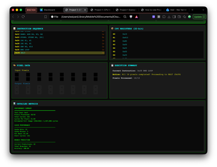](Sources/Local/Screenshots/BC-2.png) |
| [Original BC-1](Sources/Local/Screenshots/BC-1.png) | [Original BC-2](Sources/Local/Screenshots/BC-2.png) |

#### Run 2 — Worst Case, Local

| Summary and registers | Pixels and metrics |
|---|---|
| [](Sources/Local/Screenshots/WC-1.png) | [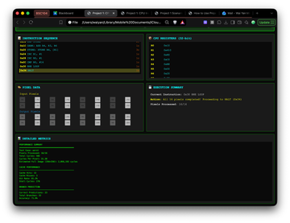](Sources/Local/Screenshots/WC-2.png) |
| [Original WC-1](Sources/Local/Screenshots/WC-1.png) | [Original WC-2](Sources/Local/Screenshots/WC-2.png) |

#### Run 3 — Real Case 1, Local

| Summary and registers | Pixels and metrics |
|---|---|
| [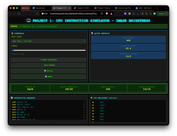](Sources/Local/Screenshots/RC1-1.png) | [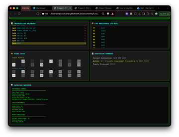](Sources/Local/Screenshots/RC1-2.png) |
| [Original RC1-1](Sources/Local/Screenshots/RC1-1.png) | [Original RC1-2](Sources/Local/Screenshots/RC1-2.png) |

#### Run 4 — Real Case 2, Local

| Summary and registers | Pixels and metrics |
|---|---|
| [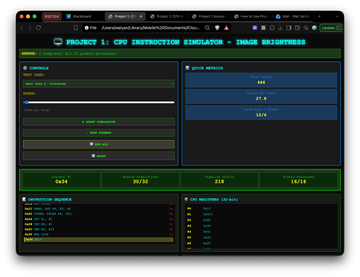](Sources/Local/Screenshots/RC2-1.png) | [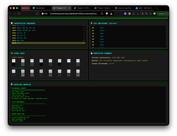](Sources/Local/Screenshots/RC2-2.png) |
| [Original RC2-1](Sources/Local/Screenshots/RC2-1.png) | [Original RC2-2](Sources/Local/Screenshots/RC2-2.png) |

#### Run 5 — Best Case, Scarlet

| Summary | Registers and pixels | Metrics |
|---|---|---|
| [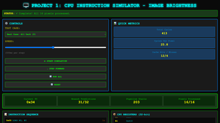](Sources/Scarlet/Screenshots/BC-R2-1.png) | [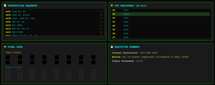](Sources/Scarlet/Screenshots/BC-R2-2.png) | [](Sources/Scarlet/Screenshots/BC-R2-3.png) |
| [Original BC-R2-1](Sources/Scarlet/Screenshots/BC-R2-1.png) | [Original BC-R2-2](Sources/Scarlet/Screenshots/BC-R2-2.png) | [Original BC-R2-3](Sources/Scarlet/Screenshots/BC-R2-3.png) |

#### Run 6 — Worst Case, Scarlet

| Summary | Registers | Pixels and metrics |
|---|---|---|
| [](Sources/Scarlet/Screenshots/WC-R2-1.png) | [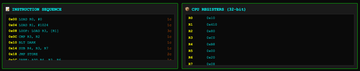](Sources/Scarlet/Screenshots/WC-R2-2.png) | [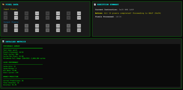](Sources/Scarlet/Screenshots/WC-R2-3.png) |
| [Original WC-R2-1](Sources/Scarlet/Screenshots/WC-R2-1.png) | [Original WC-R2-2](Sources/Scarlet/Screenshots/WC-R2-2.png) | [Original WC-R2-3](Sources/Scarlet/Screenshots/WC-R2-3.png) |

#### Run 7 — Real Case 1, Scarlet

| Summary | Registers | Pixels and metrics |
|---|---|---|
| [](Sources/Scarlet/Screenshots/RC1-R2-1.png) | [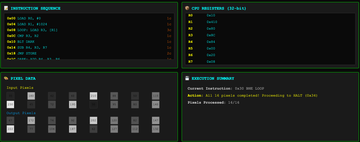](Sources/Scarlet/Screenshots/RC1-R2-2.png) | [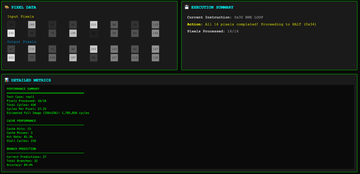](Sources/Scarlet/Screenshots/RC1-R2-3.png) |
| [Original RC1-R2-1](Sources/Scarlet/Screenshots/RC1-R2-1.png) | [Original RC1-R2-2](Sources/Scarlet/Screenshots/RC1-R2-2.png) | [Original RC1-R2-3](Sources/Scarlet/Screenshots/RC1-R2-3.png) |

#### Run 8 — Real Case 2, Scarlet

| Summary | Registers | Pixels and metrics |
|---|---|---|
| [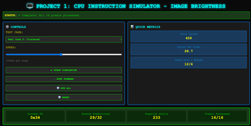](Sources/Scarlet/Screenshots/RC2-R2-1.png) | [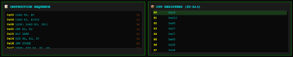](Sources/Scarlet/Screenshots/RC2-R2-2.png) | [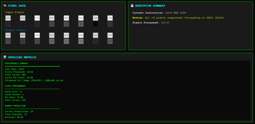](Sources/Scarlet/Screenshots/RC2-R2-3.png) |
| [Original RC2-R2-1](Sources/Scarlet/Screenshots/RC2-R2-1.png) | [Original RC2-R2-2](Sources/Scarlet/Screenshots/RC2-R2-2.png) | [Original RC2-R2-3](Sources/Scarlet/Screenshots/RC2-R2-3.png) |

### A.2 Complete checkpoint sequences — Runs 9–12

Read each sequence left to right across the first row, then the second row. These are the six captured checkpoints of one run, not six separate experiments.

#### Run 9 — Best Case trace

| Setup | First load | First branch |
|---|---|---|
| [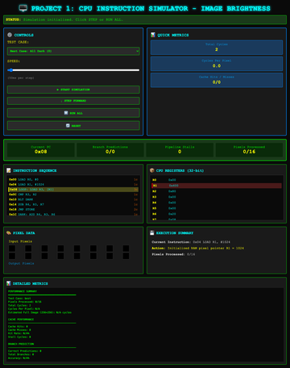](Traces/Run9_BC_01_setup.png) | [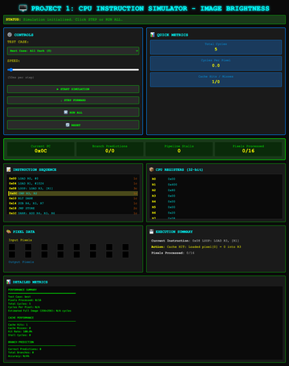](Traces/Run9_BC_02_first_load.png) | [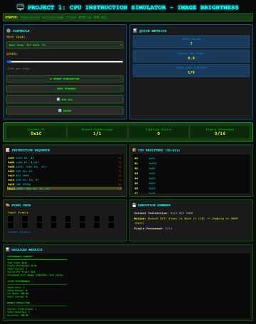](Traces/Run9_BC_03_first_branch.png) |
| [Original: setup](Traces/Run9_BC_01_setup.png) | [Original: first load](Traces/Run9_BC_02_first_load.png) | [Original: first branch](Traces/Run9_BC_03_first_branch.png) |
| **Pixel 1 complete** | **Pixel 8 complete** | **Final state** |
| [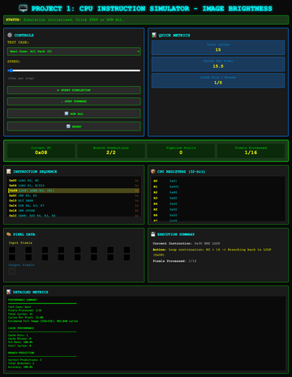](Traces/Run9_BC_04_pixel1_done.png) | [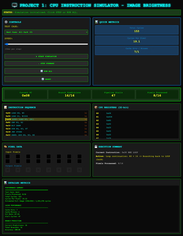](Traces/Run9_BC_05_pixel8_done.png) | [](Traces/Run9_BC_06_final.png) |
| [Original: pixel 1](Traces/Run9_BC_04_pixel1_done.png) | [Original: pixel 8](Traces/Run9_BC_05_pixel8_done.png) | [Original: final](Traces/Run9_BC_06_final.png) |

#### Run 10 — Worst Case trace

| Setup | First load | First branch |
|---|---|---|
| [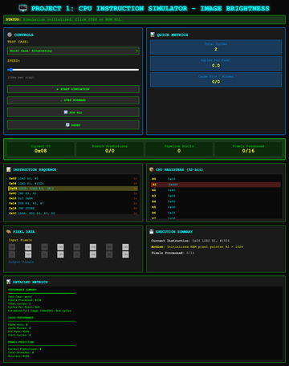](Traces/Run10_WC_01_setup.png) | [](Traces/Run10_WC_02_first_load.png) | [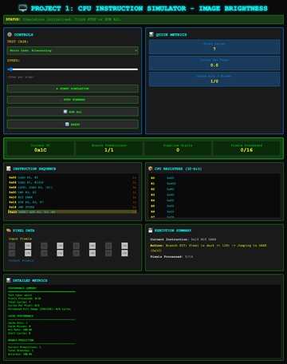](Traces/Run10_WC_03_first_branch.png) |
| [Original: setup](Traces/Run10_WC_01_setup.png) | [Original: first load](Traces/Run10_WC_02_first_load.png) | [Original: first branch](Traces/Run10_WC_03_first_branch.png) |
| **Pixel 1 complete** | **Pixel 8 complete** | **Final state** |
| [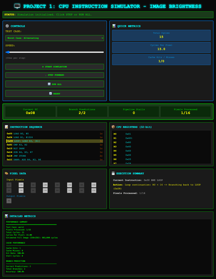](Traces/Run10_WC_04_pixel1_done.png) | [](Traces/Run10_WC_05_pixel8_done.png) | [](Traces/Run10_WC_06_final.png) |
| [Original: pixel 1](Traces/Run10_WC_04_pixel1_done.png) | [Original: pixel 8](Traces/Run10_WC_05_pixel8_done.png) | [Original: final](Traces/Run10_WC_06_final.png) |

#### Run 11 — Real Case 1 trace

| Setup | First load | First branch |
|---|---|---|
| [](Traces/Run11_RC1_01_setup.png) | [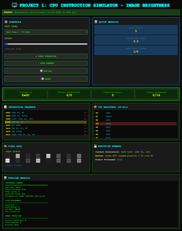](Traces/Run11_RC1_02_first_load.png) | [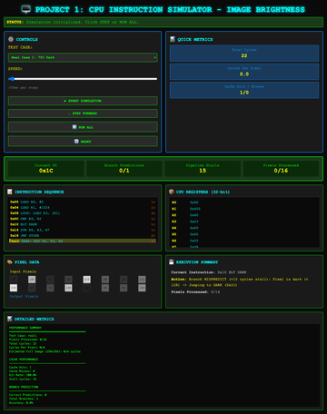](Traces/Run11_RC1_03_first_branch.png) |
| [Original: setup](Traces/Run11_RC1_01_setup.png) | [Original: first load](Traces/Run11_RC1_02_first_load.png) | [Original: first branch](Traces/Run11_RC1_03_first_branch.png) |
| **Pixel 1 complete** | **Pixel 8 complete** | **Final state** |
| [](Traces/Run11_RC1_04_pixel1_done.png) | [](Traces/Run11_RC1_05_pixel8_done.png) | [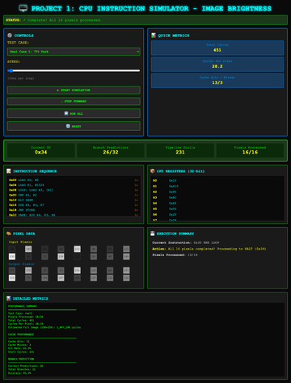](Traces/Run11_RC1_06_final.png) |
| [Original: pixel 1](Traces/Run11_RC1_04_pixel1_done.png) | [Original: pixel 8](Traces/Run11_RC1_05_pixel8_done.png) | [Original: final](Traces/Run11_RC1_06_final.png) |

#### Run 12 — Real Case 2 trace

| Setup | First load | First branch |
|---|---|---|
| [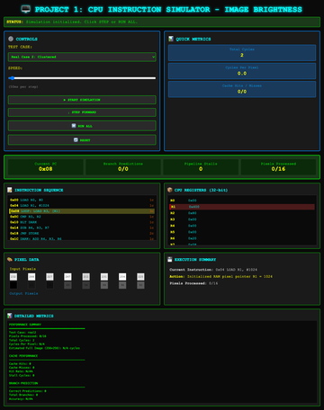](Traces/Run12_RC2_01_setup.png) | [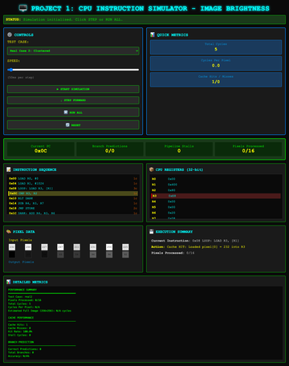](Traces/Run12_RC2_02_first_load.png) | [](Traces/Run12_RC2_03_first_branch.png) |
| [Original: setup](Traces/Run12_RC2_01_setup.png) | [Original: first load](Traces/Run12_RC2_02_first_load.png) | [Original: first branch](Traces/Run12_RC2_03_first_branch.png) |
| **Pixel 1 complete** | **Pixel 8 complete** | **Final state** |
| [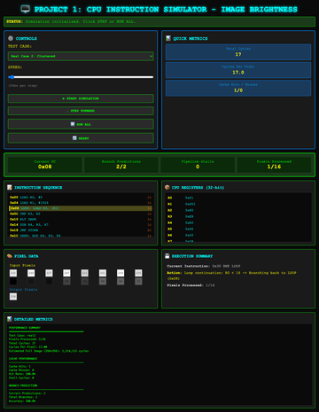](Traces/Run12_RC2_04_pixel1_done.png) | [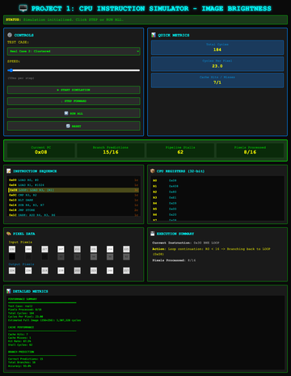](Traces/Run12_RC2_05_pixel8_done.png) | [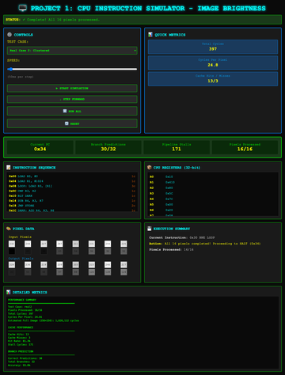](Traces/Run12_RC2_06_final.png) |
| [Original: pixel 1](Traces/Run12_RC2_04_pixel1_done.png) | [Original: pixel 8](Traces/Run12_RC2_05_pixel8_done.png) | [Original: final](Traces/Run12_RC2_06_final.png) |

### A.3 Optimization sample screenshots

These five screenshots show individual final states captured for the measurement study. They are separate from Runs 1–12 and **do not display the 40-run means**. Use the measurements in Section 3 and the [raw-data summary](Optimizations/measured_summary.json) for the strategy comparison.

| Baseline | Branch-free |
|---|---|
| [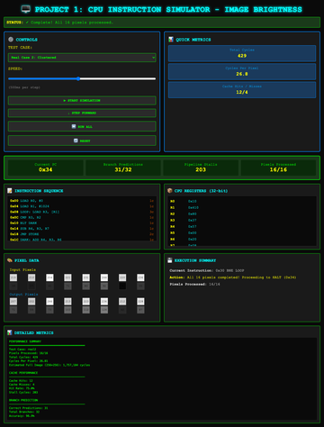](Optimizations/baseline_final_state.png) | [](Optimizations/branchfree_final_state.png) |
| [Original: baseline](Optimizations/baseline_final_state.png) | [Original: branch-free](Optimizations/branchfree_final_state.png) |

| Unrolled | Loop-test |
|---|---|
| [](Optimizations/unrolled_final_state.png) | [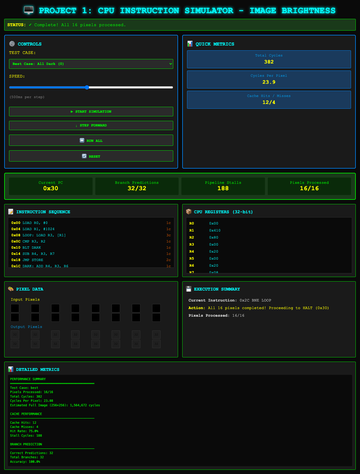](Optimizations/looptest_final_state.png) |
| [Original: unrolled](Optimizations/unrolled_final_state.png) | [Original: loop-test](Optimizations/looptest_final_state.png) |

[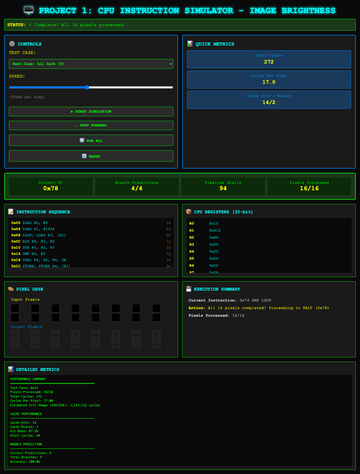](Optimizations/combined_final_state.png)

**Combined program — sample final state.** [Original screenshot](Optimizations/combined_final_state.png).
